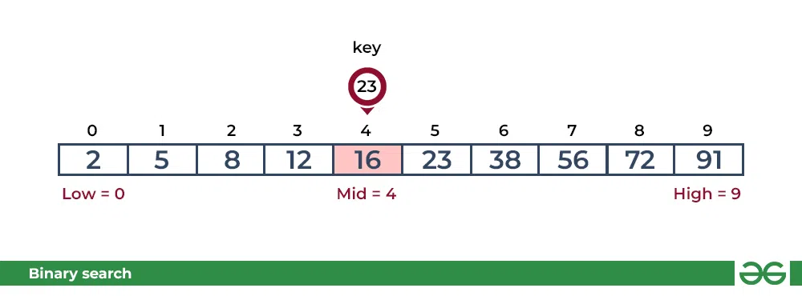
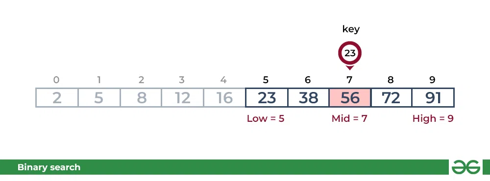
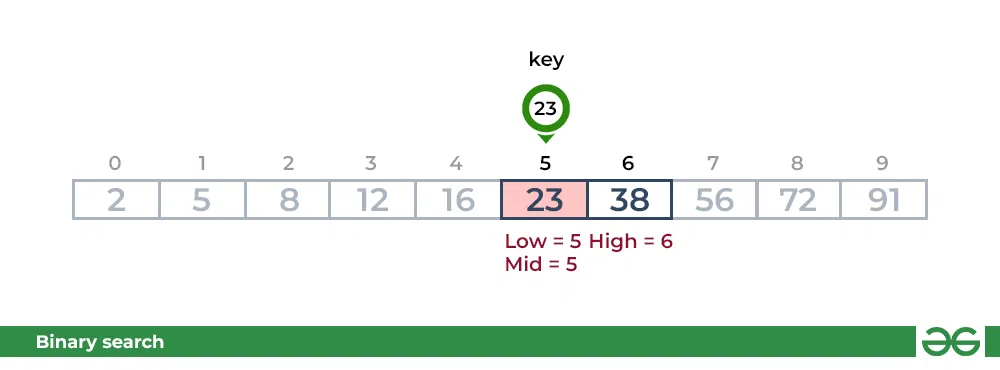

Introduction:

Binary Search is defined as a searching algorithm used in a sorted array by repeatedly dividing the search interval in half in order to narrow down the possible locations of a target value

Algorithm description:

The Binary Search Algorithm can be implemented in the following two ways:

Iterative Binary Search Algorithm.

Recursive Binary Search Algorithm.


I. Iterative  Binary Search Algorithm:

1. Initialization: 

    * Set the left pointer (`l`) to the beginning of the array (usually 0).
    * Set the right pointer (`r`) to the end of the array (length - 1).

    ```js
    let l = 0;
	let r = arr.length - 1;
    ```

2. Iterative Loop:

    Use a while loop that continues as long as the right pointer is greater than or equal to the left pointer.

    ```js
    while (r>= l) 
    ```
        
    3.Midpoint Calculation:

    Calculate the midpoint (mid) of the current search range using the formula: mid =low + (high - low) / 2. This identifies the index in the middle of the current search range.


    ```js
    let mid = l + Math.floor((r - l) / 2);

    ```

    4.Target Comparison:


    Compare the value at the midpoint with the target value.
    If they are equal, the target has been found, and the index is returned.
    If the value at the midpoint is greater than the target, update the right pointer to mid - 1 to search in the left half.
    If the value at the midpoint is less than the target, update the left pointer to mid + 1 to search in the right half.
    
    ```js
        {if (arr[mid] == x)
			return mid; //target found

	// If element is smaller than mid, then it can only be present in left sub-array
		if (arr[mid] > x)
			r = mid - 1;
			
		// Else the element can only be present in the right sub-array
		else
			l = mid + 1;
	}
   
	// We reach here when element is not present in array
	return -1;
    ```

    5.Repeat the Process:

    Repeat steps 3-4 until the left pointer becomes greater than the right pointer.

    6.Target Not Found:

    If the loop exits and the left pointer is greater than the right pointer, the target is not present in the array, and the algorithm returns -1.
    ```js 
    
    
    function binarySearch(arr, x)
    { 
        //initializing of l and r which are going to be the ends of the search interval
	    let l= 0;
	    let r = arr.length - 1;
        //declaring mid which is going to be the middle index of the search interval
	    let mid;
        // creating a while loop that will run as long as the search interval has at least one element 
	    while (r >= l) {
		mid = l + Math.floor((r - l) / 2);

        //If the element is present at the middle index we are going to return the middle index
		
		if (arr[mid] == x)
			return mid; //target found

	    // If element is smaller than mid, then it can only be present in left sub-array
		if (arr[mid] > x)
			r = mid - 1;
			
		// Else the element can only be present in the right sub-array
		else
			l = mid + 1;
	    }
   
	    // We reach here when element is not present in array
	    return -1; 
        } 

	
      (result == -1) ? console.log("Element is not present in array")
			: console.log ("Element is present at index " + result);
    ```


    Illustration:

    Consider an array arr = [2, 5, 8, 12, 16, 23, 38, 56, 72, 91], and the target = 23.

    First Step: Calculate the mid and compare the mid element with the key. If the key is less than mid element, move to left and if it is greater than the mid then move search space to the right.

     * Key (i.e., 23) is greater than current mid element (i.e., 16). The search space moves to the right.
    

     * Key is less than the current mid 56. The search space moves to the left.
    

        Second Step: If the key matches the value of the mid element, the element is found and stop search.

     
 


II. Recursive Binary Search Algorithm:

1. Base Case:

    If the left pointer is greater than the right pointer, return -1 to indicate that the target is not found in the current search range.

2. Midpoint Calculation:

    Calculate the midpoint (mid) of the current search range using the formula: mid = l + (r- l) / 2.

3. Target Comparison:

    Compare the value at the midpoint with the target value.
    If they are equal, return the index of the midpoint.
    If the value at the midpoint is less than the target, make a recursive call with the updated left pointer (l = mid + 1) to search in the right half.
    If the value at the midpoint is greater than the target, make a recursive call with the updated right pointer (r = mid - 1) to search in the left half.

4. Recursive Calls:

    The recursive calls continue until the base case is reached, and the function returns either the index of the target or -1 if the target is not found.

         ```js	
        // JavaScript program to implement recursive Binary Search

        // A recursive binary search function. It returns
        // location of x in given array arr[l..r] is present,
        // otherwise -1
        function binarySearch(arr, low, high, x){
            if (high >= low) {
                let mid = low + Math.floor((high - low) / 2);

                // If the element is present at the middle
                // itself
                if (arr[mid] == x){
                    return mid;}

                // If element is smaller than mid, then
                // it can only be present in left sub-array
                else if (arr[mid] > x){
                    return binarySearch(arr, low, mid - 1, x);}
                else{
                // Else the element can only be present
                // in right sub-array
                return binarySearch(arr, mid + 1, high, x);}
            }

            // We reach here when element is not
            // present in array
            return -1;
            }
             ```
            


Big O Evaluation:

Time Complexity: 

Best Case: O(1)

Average Case: O(log N)

Worst Case: O(log N)

Space complexity: 
O(1), If the recursive call stack is considered then the auxiliary space will be O(logN).

Advantages of Binary Search:

   * Binary search is faster than linear search, especially for large arrays.
   * More efficient than other searching algorithms with a similar time complexity
   * Binary search is well-suited for searching large datasets that are stored in external memory, such as on a hard drive or in the cloud.

Drawbacks of Binary Search:

   * The array should be sorted.
   * Binary search requires that the elements of the array be comparable, meaning that they must be able to be ordered.

Use Cases:
* Searching in Sorted Arrays
* Finding Closest Values
* Spell Checkers and Autocorrect


Citation:

https://www.geeksforgeeks.org/binary-search/

https://chat.openai.com/share/ab634118-f6e7-4df9-8ab3-f4d9b5c29f94

https://medium.com/@imanshu822/binary-search-and-its-powerful-applications-39ae7d7bca69#:~:text=Searching%20in%20Sorted%20Arrays%3A%20Binary,specific%20value%20in%20large%20datasets.


